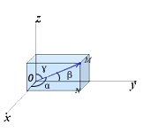
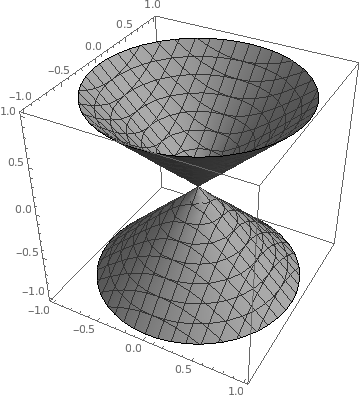
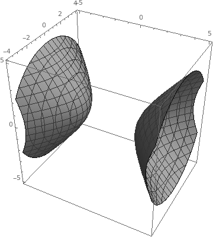
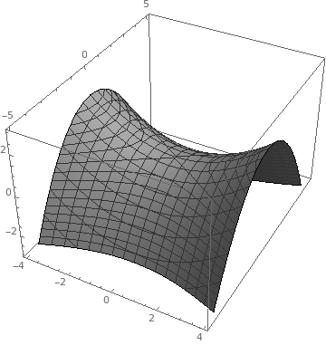

# 向量代数与空间解析几何

## 向量基本概念

数量积
: $\vec{u} \cdot \vec{v} = |u| |v| cos\ \theta$

向量积
: $(a, b, c) \times (d, e, f) = \begin{vmatrix}\vec{i} & \vec{j} & \vec{k} \\ a & b & c \\ d & e & f\end{vmatrix}$

混合积(平行六面体体积)
: $[\vec{a}\ \vec{b}\ \vec{c}] = (\vec{a} \cdot \vec{b}) \times \vec{c} = \begin{vmatrix} a_x & a_y & a_z \\  b_x & b_y & b_z \\ c_x & c_y & c_z\end{vmatrix}$

    证明三线共面
    : $[\vec{a}\ \vec{b}\ \vec{c}] = 0$

$\vec{r}$在$\vec{c}$上的投影
: $Prj_{\vec{c}} \vec{r}$

向量余弦
: 对于向量$\vec{a} (a_x, a_y, a_z)$, 方向余弦为$\begin{cases}cos\ \alpha = \dfrac{a_x}{|a|} \\ cos\ \beta = \dfrac{a_y}{|a|} \\ cos\ \gamma = \dfrac{a_z}{|a|}\end{cases}$

    {width=100px}

## 空间曲面与空间曲线

曲面方程
: $F(x, y, z) = 0$

曲线方程
: 两曲面交线: $\begin{cases}F(x, y, z) = 0 \\ G(x, y, z) = 0\end{cases}$

### 平面方程

点法式方程
: 平面有法向量$\vec{n} = (A, B, C)$, 且经过点$M_0 (x_0, y_0, z_0)$, 平面方程为$A (x - x_0) + B (y - y_0) + C (z - z_0) = 0$

一般方程
: $Ax + By + Cz + D = 0$

截距式方程
: $\frac{x}{a} + \frac{y}{b} + \frac{z}{c} = 1$, $a$, $b$, $c$为平面在$x$, $y$, $z$轴上的截距

## 空间直线方程

一般方程
: $\begin{cases}A_1 x + B_1 y + C_1 z + D_1 = 0 \\ A_2 x + B_2 y + C_2 z + D_2 = 0\end{cases}$

方向方程, 对称式方程, 点向式方程
: 直线有方向向量$\vec{s} = (m, n, p)$, 且经过点$M_0 (x_0, y_0, z_0)$, 直线方程为$\frac{x - x_0}{m} = \frac{y - y_0}{n} = \frac{z - z_0}{p}$

参数方程
: $\begin{cases}x = x_0 + mt \\ y = y_0 + nt \\ z = z_0 + pt\end{cases}$

::: {.example}
用对称式方程与参数方程表示$\begin{cases}x + y + z + 1 = 0 \\ 2x - y + 3z + 4 = 0\end{cases}$

两平面法向量分别为$\vec{u} = (1, 1, 1)$, $\vec{v} = (2, -1, 3)$, 直线方向向量为

$$s = \vec{u} \times \vec{v} = (4, -1, -3)$$

在方程组中任取一点$(1, 0, -2)$, 可得对称式方程

$$\frac{x - 1}{4} = \frac{y}{-1} = \frac{z + 2}{-3}$$

令$\frac{x - 1}{4} = \frac{y}{-1} = \frac{z + 2}{-3} = t$, 得参数方程:

$$
\begin{cases}
x = 1 + 4t \\
y = -t \\
z = -2 -3t
\end{cases}
$$
:::

### 夹角

直线与直线夹角
: $cos \varphi = \frac{|\vec{u} \cdot \vec{v}|}{|\vec{u}||\vec{v}|}$

直线与平面夹角
: $sin \varphi = \frac{|\vec{u} \cdot \vec{n_{\text{法}}}|}{|\vec{u}||\vec{n_{\text{法}}}|}$

### 平面束方程

平面束
: 通过定直线的所有平面的全体

对于直线

$$\begin{cases}
A_1 x + B_1 y + C_1 z + D_1 = 0 \\
A_2 x + B_2 y + C_2 z + D_2 = 0
\end{cases}$$

平面束方程为

$$A_1 x + B_1 y + C_1 z + D_1 + \lambda (A_2 x + B_2 y + C_2 z + D_2) = 0$$

::: {.example}
求直线$\begin{cases}x + y - z - 1 = 0 \\ x - y + z + 1 = 0\end{cases}$, 在平面$x + y + z = 0$上的投影直线方程

过直线$\begin{cases}x + y - z - 1 = 0 \\ x - y + z + 1 = 0\end{cases}$的平面束方程为:

\begin{align*}
x + y - z - 1 + \lambda (x - y + z + 1) &= 0 \\
(1 + \lambda) x + (1 - \lambda) y + (-1 + \lambda) z + (-1 + \lambda) &= 0
\end{align*}

两平面垂直, 即$(1 + \lambda) ( 1 ) + (1 - \lambda) ( 1 ) + (-1 + \lambda) ( 1 ) = 0 \Rightarrow \lambda = -1$

代入平面束方程得: $y - z - 1 = 0$

所有投影直线方程为

$$
\begin{cases}
y - z - 1 = 0 \\
x + y + z = 0
\end{cases}
$$
:::

## 空间曲面方程(二次曲面)

1. **椭圆锥面** $\frac{x^2}{a^2} + \frac{y^2}{b^2} = z^2$

   {width=100px}

1. **椭球面** $\frac{x^2}{a^2} + \frac{y^2}{b^2} + \frac{z^2}{c^2} = 1$

   {width=100px}

1. **单叶双曲线** $\frac{x^2}{a^2} + \frac{y^2}{b^2} - \frac{z^2}{c^2} = 1$

    {width=100px}

    旋转单叶双曲面
    : $\frac{x^2 + y^2}{a^2} - \frac{z^2}{c^2} = 1$

1. **双叶双曲线** $\frac{x^2}{a^2} + \frac{y^2}{b^2} - \frac{z^2}{c^2} = 1$

    {width=100px}

    旋转双叶双曲面
    : $\frac{x^2}{a^2} - \frac{y^2 + z^2}{c^2} = 1$

1. **椭圆抛物面** $\frac{x^2}{a^2} + \frac{y^2}{b^2} = z$

    抛物线绕$z$轴旋转

    {width=100px}

    旋转抛物面
    : $\frac{x^2 + y^2}{a^2} = z$

1. **双曲抛物面** $\frac{x^2}{a^2} - \frac{y^2}{b^2} = z$

    {width=100px}

    形成原理见P44

1. **椭圆柱面** $\frac{x^2}{a^2} + \frac{y^2}{b^2} = 1$

1. **双曲柱面** $\frac{x^2}{a^2} - \frac{y^2}{b^2} = 1$

1. **抛物柱面** $x^2 = ay$

### 曲面参数方程

$\begin{cases}x = x(s, t) \\ y = y(s, t) \\ z = z(s, t)\end{cases}$

对于空间曲线$\begin{cases}x = \varphi(t) \\ y = \psi(t) \\ z = \omega(t)\end{cases}$绕$z$轴旋转得旋转曲面方程为

$$\begin{cases}
x = \sqrt{\varphi(t)^2 + \psi(t)^2} sin\ \theta \\
y = \sqrt{\varphi(t)^2 + \psi(t)^2} sin\ \theta \\
z = \omega(t)
\end{cases}$$

球面
: 由$zOx$上的半圆周$\begin{cases}x = asin\ \varphi \\ y = 0 \\ z = zcos\ \varphi\end{cases}, 0 \leq \varphi \leq \pi$绕$z$轴旋转所得

$$\begin{cases}x = asin\ \varphi cos\ \theta \\ y = asin\ \varphi sin\ \theta \\ z = acos\ \varphi\end{cases}, 0 \leq \varphi \leq \pi, 0 \leq \theta \leq 2\pi$$

## 空间曲线方程

一般方程
: $\begin{cases}F(x, y, z) = 0 \\ G(x, y, z) = 0\end{cases}$

参数方程
: $\begin{cases}x = x(t) \\ y = y(t) \\ z = z(t)\end{cases}$

### 空间曲线在座标面上的投影

::: {.example}
求曲线$\begin{cases}x^2 + y^2 + z^2 = 1 \\ x^2 + (y - 1)^2 + (z - 1)^2 = 1\end{cases}$在$xOy$轴上的投影

首先消去$z$轴

$$\begin{cases}
x^2 + y^2 + z^2 = 1 \\ x^2 + (y - 1)^2 + (z - 1)^2 = 1
\end{cases} \Rightarrow y + z = 1$$

代入任一方程中得

$$x^2 + 2y^2 - 2y = 0$$

得到投影方程为

$$\begin{cases}x^2 + 2y^2 - 2y = 0 \\ z = 0\end{cases}$$
:::
