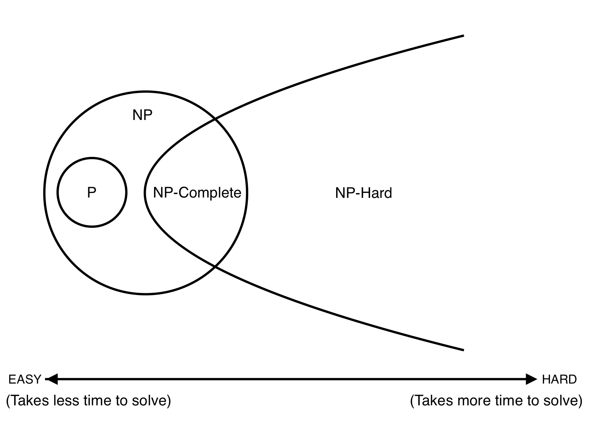
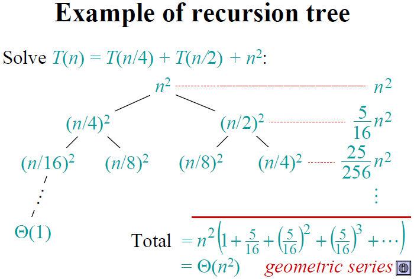

<!--
    vi: ft=pandoc.markdown
-->

# 复习

## 题型

* 简答 $8 \times 8$
* 综合 $3 \times 12$

注意**作业**, **算法思路怎么写?**

## 大纲

### 概述 (第一章)

算法
: 解决问题的一种方法或一个过程, 包括输入输出, 确定性和有限性

程序
: 算法用某种程序设计语言的具体实现, 且不必有限

时间复杂度, 渐进符号
: $\omega < \Omega \leq \Theta \leq O < o$

#### P/NP

P
: 多项式时间内可解决的判定问题

NP
: 在多项式时间内可验证的判定问题

[NPC]
: NPC是一个NP问题, 任意一个NP问题都可以多项式时间内可归约到[NPC]

[NPH]
: 任意一个NP问题都可以多项式时间内可归约到[NPH]

{width=50%}

#### 时间复杂度

常见时间复杂度
: $O(1)\text{(奇偶判断)} < O(log\ n)\text{(二分查找)} < O(n^{\frac{1}{2}}) < O(n) < O(n * log\ n) < O(n^2) < O(n^3) \leq P\text{(多项式时间)} < O(2^n) < O(n!)$

$T = kT(n/m) + f(n) = O(n^{log_m k}) + O(f(n))$

{width=50%}

### 递归与分治 (第二章)

#### 二分搜索

时间复杂度
: while循环被执行了$O(log\ n)$次, 循环体内需要$O(1)$时间, 因此为$O(log\ n)$

1. 分个数相近的2部分 `[(<x), x, (>x)]`

#### 棋盘覆盖

1. 用3L骨牌, 分4个特殊骨牌

#### 循环赛日程表

1. 分配n/2个选手, 直到两个选手

### DP (第三章)

::: {.example}
DP与分治区别?

* 都是由下向上, 过程都是递归的
* 但动态规划避免了重复计算
:::

#### 矩阵连乘

$O(n^3)$

$min[i:j] = \left\{ \begin{array}{ll} 0 & i = j\\ min\{min[i:k] + min[k+1:j] + p_{i-1}p_kp_j\} & i < j \end{array} \right.$

#### 流水作业调度

1. $N_1 = { i \mid a_i < b_i }$, $N_2 = { i \mid a_i \geq b_i }$
2. $N_1$按$a_i$非减序, $N_2$按$b_i$非增序
3. 一个个来

#### 01背包问题

``` {.haskell}
m :: [(Int, Int)] -> Int -> Int
m ((w,v):[]) size | w > size = 0
                  | otherwise = v
m ((w,v):xs) size | w > size = m xs size
                  | otherwise = max (m xs size) ((m xs $ size - w) + v)
```

### 贪心算法 (第四章)

什么是贪心算法?
: 能找到贪心条件, 但*不一定*是最优解

#### 哈夫曼编码

每次选择频率最高的字符构造树

#### 单源最短路径

顶点集合S, 不断贪心选择到集合外元素路径中最短的来扩充这个集合, 当S中包含了所有顶点即可

##### 贪心选择性质

算法贪心选择具有最短特殊路径顶点u(即dist[u]是源外dist集合中最小的元素). 若存在一点x在源集合外, 这条路从S出发到x, 再在S内外徘徊若干次, 最后离开S到u. 证明不存在能使这条路径能比dist[u]更近.

假设存在这么一条路径. 即$d(v, u) = d(v, x) + d(v, u) < dist[u]$

易得$dist[x] \leq d(v,x)$

由于$d(v, u) > 0$, 可得$dist[x] < dist[u]$

与条件矛盾, 得证

##### 最优子结构性质

证明dist[u]即当前源到u的最短路径.

**对于源外的点u:**

若此时贪心选择了i(即$dist[i]$为当前源外dist中最小值), 存在一条i到u的路径, 且$dist[i] + c[i][u] < dist[u]$

那么$dist[i] + c[i][u]$将作为$dist[u]$的新值, 显然成立.

**对于源内的点u:**

若此时贪心选择了i(即$dist[i]$为当前源外dist中最小值), 存在一条i到u的路径, 且$dist[i] + c[i][u] < dist[u]$

那么$dist[i] < dist[u]$, 与条件矛盾. 即不存在$dist[i] + c[i][u] < dist[u]$.

综上得证

#### 最小生成树

1. Prim: 从树内顶点到树外顶点的边中选最短的一个
2. Kruskal: 从连接不同连通分支的边中选最短的一个

#### 多机调度问题

优先大作业

### 回溯法, 分支限界法 (第五, 六章)

{ DFS, BFS } + 减支 + 动态生成解空间树

#### 回溯法

##### 01背包问题

DFS完全二叉树. 到达某节点时若超重则剪去

##### 旅行售货员问题

DFS地图. 到某节点时若耗时比已知最短距离长则剪去

#### 分支限界法

##### 单源最短路径

BFS图. 可选用优先队列BFS

到某节点时, 若比已知到此节点的距离长, 或已知最短到达目标的距离长, 则剪去

### 随机化算法

#### PI值

``` {.python}
4 * definite_integral(lambda x: sqrt(1 - x**2))
```

#### 定积分

``` {.python}
def definite_integral(f, n = 100000):
    k = 0
    for i in range(n):
        x, y = random(), random()
        if f(x) >= y:
            k += 1
    return k / n
```