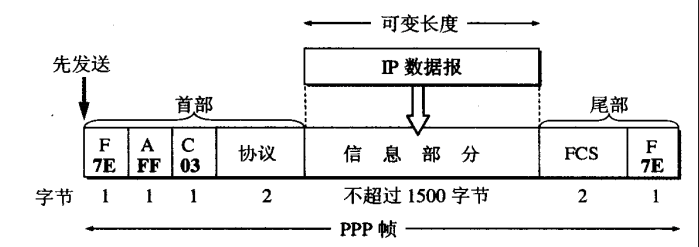

<!--
  vi: ft=pandoc.markdown
-->

# 数据链路层

`数据链路层`{.idx}

功能
: 相邻结点无差错传输

设备
: 网卡(NIC卡), 交换机(全双工, MAC学习), 网桥(一对接口)

物理链路
: 一个结点到相邻结点的一段物理线路

逻辑链路(数据链路)
: 物理链路 + 通讯协议

帧
: 数据链路层的协议数据单元

## 三个基本问题

封装成帧
: 数据前后加`SOH`和`EOT`

透明传输
: 转移字符`ESC`, 字节填充

差错校验
: 冗余循环校验(CRC) (P74-75)

\noindent
*注意* 无差错接收**不等于可靠传输**, 只保证接收的帧均无差错

## 点对点(PPP)

需求
: 简单, 封装成帧, 透明层, 多种网络协议, 多种连接链路 (串行/并行), 差错校验, 检测连接状态, 最大传送单元, 网络层地址协商, 数据压缩协商 

不需要的功能 
: 纠错, 流量控制(传输速率), 序号, 多点线路, 半双工或单共链路(仅支持全双工)

### 字节填充

实现异步透明传输

* $0x7E \rightarrow 0x7D\ 0x5E$
* $0x7D \rightarrow 0x7D\ 0x5D$
* $<0x20 \rightarrow 0x7D\ (<0x20 + 0x20)$

### 零比特填充

实现同步透明传输, 连续5个1插入1个0

$111111 \rightarrow 1111101$

## 广播

主要解决的问题
: 寻址, 信道使用权

共享信道
: 静态划分信道 (多路复用), 动态媒体接入控制 (随机接入: **以太网**, 受控接入)

### CSMA/CD协议

`CSMA/CD`{.idx}

载波监听多点接入/碰撞检测 Carrier-sense multiple access with collision detection, 即**先听后说, 一旦冲突, 立即停说**

\begin{tikzpicture}
  \coordinate (A to B) at (5,0);
  \coordinate (B to A) at ($(0,0) - (A to B)$);
  \coordinate (tau) at (0,-1);
  \coordinate (2tau) at ($(tau) + (tau)$);
  \coordinate (contention) at ($(2tau) + (0,-0.1)$);
  \coordinate (noise) at (0,-0.1);
  \coordinate (delay) at (0,-0.2);

  \draw[line width=1pt]
     (0,0) node[above left] (A tag) {A} node[coordinate] (A) {}
     -- +(A to B) node[above right] (B tag) {B} node[coordinate] (B) {};

  \draw[<->] (A tag) -- node[fill=white] {1km} (B tag);
  \draw[<->] ($(A) + (-7pt,0)$) -- node[fill=white] {$2\tau$} +(2tau);
  \draw[<->] ($(B) + (7pt,0)$) -- node[fill=white] {$\tau$} +(tau);
  \draw[style=densely dotted] ($(A) + (-14pt,0) + (2tau)$) -- ($(B) + (14pt,0) + (2tau)$);
  
  \draw (A) -- +(0,-8.7);
  \draw (B) -- +(0,-8);

  % A
  \coordinate (A path) at (A);
  \draw[->,style=dashed] (-1,-0.5) node[left] {发送} -- (A path);

  % 发送真实数据
  \draw[->] (A path) -- +($(A to B) + (tau)$);
  \fill[fill opacity=0.3,color=blue] (A path) -- ++($(A to B) + (tau)$) -- ++(0,-1) -- ++($(B to A) - (tau)$) -- cycle;
  \coordinate (A path) at ($(A path) + (0,-1)$);

  % 发送数据填充
  \fill[fill opacity=0.3,color=black] (A path) -- ++($(A to B) + (tau)$) -- ++(0,-0.6) -- ++($(B to A) - (tau)$) -- cycle;
  \coordinate (A path) at ($(A path) + (0,-0.6)$);
  \draw[|-|] ($(A) + (8pt,0)$) -- node[right,text=white] {$T_B$} ($(A path) + (8pt,0)$);

  % 检测到碰撞, 发送强化碰撞
  \fill[fill opacity=0.3,color=red] (A path) -- ++($(A to B) + (tau)$) -- ++(noise) -- ++($(B to A) - (tau)$) -- cycle;
  \coordinate (A path) at ($(A path) + (noise)$);
  \draw[|-|] ($(A path) + (8pt,0)$) -- node[right,text=white] {$T_J$} ($(A path) - (noise) + (8pt,0)$);
  \draw[|-|] ($(A path) + (8pt,0)$) -- node[right,text=black] {$\tau$} +($(tau)$);
  \draw[style=densely dotted] ($(A path) + (tau) + (-14pt,0)$) -- +($(A to B) + (28pt,0)$);

  % 开始发送流程
  \draw[->,style=dashed] (-1,-2.5) node[left,text width=90pt,draw] {$r=0$, 准备开始重传} -- (A path);

  % 检测到信道空闲
  \coordinate (A path) at ($(A path) + (0,-0.4)$);
  \draw[->,style=dashed] (-1,-3.5) node[left] {发现信道空闲} -- (A path);

  % 等待最小间隙
  \coordinate (A path) at ($(A path) + (delay)$);

  % 发送真实数据
  \draw[->,style=dashed] (-1,-4.5) node[left,text width=90pt,draw] {等待最小间隔, 开始发送} -- (A path);
  \fill[fill opacity=0.3,color=blue] (A path) -- ++($(A to B) + (tau)$) -- ++(0,-1) -- ++($(B to A) - (tau)$) -- cycle;
  \coordinate (A path) at ($(A path) + (0,-1)$);

  % 发送数据填充
  \fill[fill opacity=0.3,color=black] (A path) -- ++($(A to B) + (tau)$) -- ++(0,-1.1) -- ++($(B to A) - (tau)$) -- cycle;
  \coordinate (A path) at ($(A path) + (0,-1.1)$);
  \draw[->,style=dashed] (-1,-5.5) node[left] {发现完成} -- (A path);
  
  % B
  \coordinate (B path) at ($(B) + (0,-0.6)$);

  % 碰撞点
  \fill[red] (intersection cs:
                first line={(B path)--($(B path) + (B to A) + (tau)$)},
                second line={(A)--($(A) + (A to B) + (tau)$)})
             circle (2pt) node[above] {碰撞};

  % 开始发送
  \draw[->] (B path) -- +($(B to A) + (tau)$) node[coordinate] (A tmp path) {};
  \draw[->,style=dashed] (-1,-1.5) node[left] {碰撞, 停止发送} -- (A tmp path);

  \draw[->,style=dashed] ($(B) + (1, -0.5)$) node[right] {发送} -- (B path);
  \fill[fill opacity=0.3,color=blue] (B path) -- ++($(B to A) + (tau)$) -- ++(0,-0.4) -- ++($(A to B) - (tau)$) -- cycle;
  \coordinate (B path) at ($(B path) + (0,-0.4)$);

  % 检测到碰撞, 发送强化碰撞
  \draw[->,style=dashed] ($(B) + (1, -1.5)$) node[right] {碰撞, 停止发送} -- (B path);
  \fill[fill opacity=0.3,color=red] (B path) -- ++($(B to A) + (tau)$) -- ++(noise) -- ++($(A to B) - (tau)$) -- cycle;
  \coordinate (B path) at ($(B path) + (noise)$);

  % 开始等待重传
  \draw[->,style=dashed] ($(B) + (1, -2.5)$) node[right] {等待, $r = 1$} -- (B path);
  \coordinate (B path) at ($(B path) + (contention)$);

  % 开始准备重传
  \draw[->,style=dashed] ($(B) + (1, -3.5)$) node[right] {开始准备重传} -- (B path);

  % 最小间隔
  \coordinate (B path) at ($(B path) + (delay)$);
  \draw[->,style=dashed] ($(B) + (1, -4.5)$) node[right,text width=90pt,draw] {最小间隔内不空闲, 等待空闲} -- (B path);

  % 发现空闲
  \coordinate (B path) at ($(B path) + (0,-2)$);
  \draw[->,style=dashed] ($(B) + (1, -5.5)$) node[right] {发现空闲} -- (B path);

  % 开始重传
  \coordinate (B path) at ($(B path) + (delay)$);
  \draw[->,style=dashed] ($(B) + (1, -6.5)$) node[right,text width=90pt,draw] {等待最小间隔, 开始发送} -- (B path);
  \fill[fill opacity=0.3,color=blue] (B path) -- ++($(B to A) + (tau)$) -- ++(contention) -- ++($(A to B) - (tau)$) -- cycle;
  \coordinate (A path) at ($(B path) + (contention)$);

  % 图例
  \fill[fill opacity=0.3,color=blue] (-2,2) circle (2pt) node[right,text opacity=1,text=black] {数据帧};
  \fill[fill opacity=0.3,color=black] (-2,1) circle (2pt) node[right,text opacity=1,text=black] {数据填充(填充最短帧长)};
  \fill[fill opacity=0.3,color=red] (0,2) circle (2pt) node[right,text opacity=1,text=black] {强化碰撞};
\end{tikzpicture}

`CSMA/CD!$T_B$`{.idx}
实际发送帧长: $T_B$

多点接入 `CSMA/CD!多点接入`{.idx}
: 总线型网络

载波监听 `CSMA/CD!载波监听`{.idx}
: 用电子计算检测有没有计算机占用信道

碰撞检测(CD, 边发送边监听) 
: $\tau$: 单程端到端传播时延 `$\tau$`{.idx}

  `CSMA/CD!争用期`{.idx}
  碰撞检测最大时延长为$2\tau$, 将$2\tau$定义为**争用期**, 又称**碰撞窗口**, (实际中$2\tau \le \text{争用期}$)

  **10Mbps以太网**中争用期定义为512比特时间

碰撞后重传
: **退避** `退避`{.idx}

  **以太网**使用**截断二进制指数退避**

  `CSMA/CD!截断二进制指数退避`{.idx}
  截断二进制指数退避(缺乏公平性): $t = rand([0..(2^k - 1)]) \times \tau, k = min(\text{重传次数}, 10)$

最短帧长 `CSMA/CD!最短帧长`{.idx}
: $t \ge 2\tau$, **10Mbps争用期为512比特时间的以太网**中最短帧长为$64B$, 小于将短帧长的帧为无效帧

强化碰撞$T_J$ `CSMA/CD!强化碰撞`{.idx} `CSMA/CD!$T_J$`{.idx}
: 让所有用户知道发生碰撞

  `CSMA/CD!人为干扰信号`{.idx}

  **10Mbps以太网**中为$32b$或$48b$的**人为干扰信号**

最小间隔 `CSMA/CD!最小间隔`{.idx}
: **以太网**规定帧间最小间隔为96比特时间

### MAC帧

