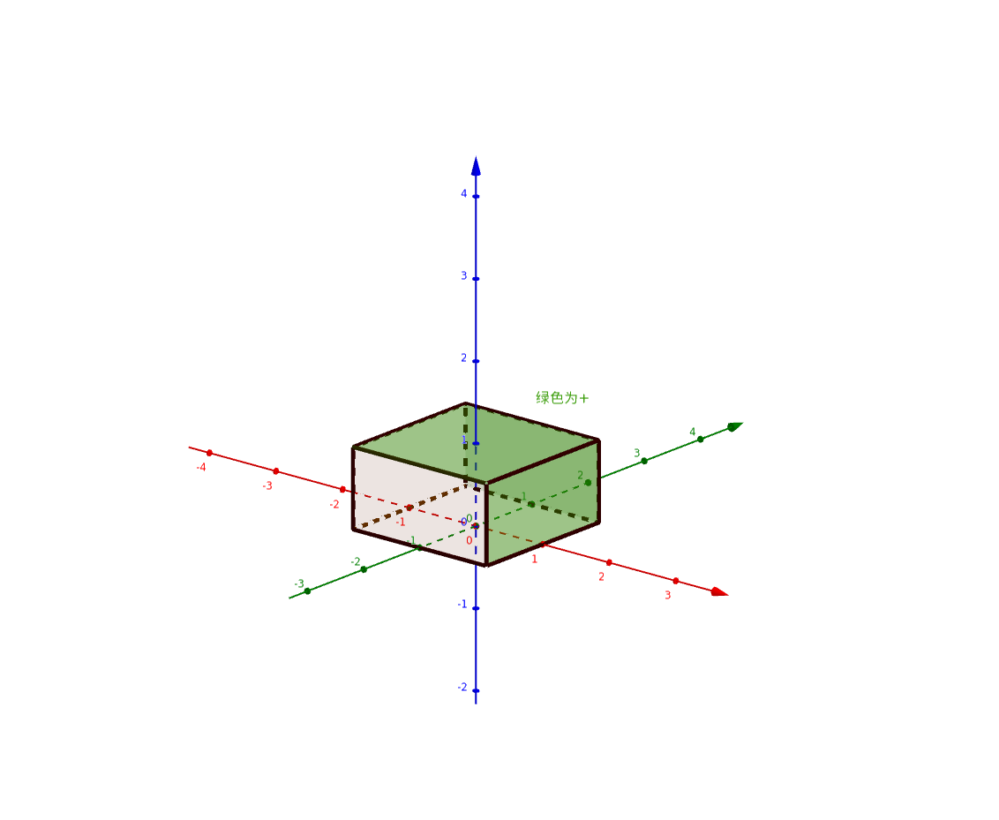

# 曲线积分与曲面积分

## 曲线积分

### 第一类曲线积分(对弧长的曲线积分)

`重点!曲线积分!第一类曲线积分`{.idx}

$$\int_L f(x, y, z) ds$$

$\left\{\begin{array}{l} x = \varphi(t)\\ y = \psi(t) \end{array}\right., (\alpha \leq t \leq \beta)$时, $\int_L f(x, y) ds$ = $\int_\alpha^\beta f[\varphi(t), \psi(t)]\sqrt{\varphi^{'2}(t) + \psi^{'2}(t)}dt$

对于显函数也可以是:

$$\int _ L f(x, y)ds = \int _ \alpha ^ \beta f(x, y(x)) \sqrt{1 + y^{'2} (x)} dx$$

典型例子
: 不均匀密度线质量

### 第二类曲线积分(对坐标的曲线积分)

`重点!曲线积分!第二类曲线积分`{.idx}

\begin{align*}
\int_L \vec{A}(x, y) \cdot d \vec{r} &= \int_L Pdx + Qdy + Rdz \\
                                     &= \int_L P(x(t), y(t), z(t)) x^{'}(t) dt + \ldots
\end{align*}

\begin{example}{%
计算$\int_L 2xy dx + x^2 dy$, 其中L为

\centering
\begin{tikzpicture}[domain=0:1]
    \draw[->] (-0.2,0) -- (1,0) node[right] {$x$};
    \draw[->] (0,-0.2) -- (0,1) node[above] {$y$};
    \draw plot (\x,\x^2) node[right] {$y = x^2$};
\end{tikzpicture}%
}
$\int_L 2xy dx + x^2 dy = \int_0^1 (2 x \cdot x^2 + x^2 \cdot 2x) dx = 1$
\end{example}

::: {.example}
计算$\int_\Gamma x^3 dx + 3zy^2 dy - x^2y dz$, 其中$\Lambda$是从点$A(3, 2, 1)$到$B(0, 0, 0)$的直线段$AB$

直线$AB$方程为$\frac{x}{3} = \frac{y}{2} = \frac{z}{1}$, 即$\begin{cases}x = 3t \\ y = 2t \\ z = t\end{cases}$, $t$从$1$到$0$, 所以

\begin{align*}
&\ \int_\Gamma x^3 dx + 3zy^2 dy - x^2y dz \\
=&\ \int_1^0 [(3t)^3 \cdot 3 + 3t(2t)^2 \cdot 2 - (3t)^2 \cdot 2t] dt\\
=&\ 87 \int_1^0 t^3 dt \\
=&\ -\frac{87}{4}
\end{align*}
:::

典型例子
: 变力沿曲线

#### 与第一类曲线积分相互转换

\begin{align*}
\int_\Gamma \vec{A} \cdot \underline{d\vec{r}} &= \int_\Gamma \vec{A} \cdot \underline{\vec{r} ds}\\
\int_L Pdx + Qdy + Rdz &= \int_L (Pcos \alpha + Qcos \beta + Rcos \gamma) ds
\end{align*}

**注意**: 切向量方向余弦求法

### 格林公式

正向
: 沿曲线方向左侧为曲线围成区域$D$

与牛顿-莱布尼兹公式相对应

平面闭区域上的二重积分与其边界曲线上的曲线积分关系

设闭区域$D$由分段光滑的曲线$L$围成, 若函数$P(x, y)$与$Q(x, y)$在$D$上具有一阶连续偏导数, 则有
$$\iint_D (\frac{\partial Q}{\partial x} - \frac{\partial P}{\partial y}) dxdy = \oint_L Pdx + Qdy$$

复连通区域右侧应包含所有曲线

`重点!曲线积分!与积分路径无关`{.idx}

::: {.mthm latex="true"}
**单连通域**内, 若$P(x, y)$与$Q(x, y)$具有一阶连续偏导数, $\frac{\partial P}{\partial y} = \frac{\partial Q}{\partial x}$, 则曲线积分$\int_L Pdx + Qdy$在区域内与积分路径无关, 且$Pdx + Qdy$是某一函数$u(x, y)$的全微分
:::

::: {.example}
$\int_{(0, 0)}^{(a, b)} xe^{x^2 + y^2} dx + ye^{x^2 + y^2} dy$

令$P = xe^{x^2 + y^2}$, $Q = ye^{x^2 + y^2}$,

\begin{align*}
\frac{\partial P}{\partial y} = 2xye^{x^2 + y^2} \\
\frac{\partial Q}{\partial x} = 2xye^{x^2 + y^2}
\end{align*}

所以在实数域内与曲线路径无关

取路径$(0, 0) \rightarrow (a, 0) \rightarrow (a, b)$

\begin{align*}
\int_{(0, 0)}^{(a, b)} xe^{x^2 + y^2} dx + ye^{x^2 + y^2} dy &= \int_{(0, 0)}^{(a, 0)} xe^{x^2 + y^2} dx + ye^{x^2 + y^2} dy + \int_{(a, 0)}^{(a, b)} xe^{x^2 + y^2} dx + ye^{x^2 + y^2} dy \\
&= \int_0^a xe^{x^2} dx + \int_0^b ye^{a^2 + y^2} dy \\
&= \left. \frac{1}{2} e^{x^2} \right| _0^a + \left. \frac{1}{2} e^{a^2 + y^2} \right| _0^b \\
&= \frac{1}{2} (-1 + e^{a^2})
\end{align*}
:::

::: {.example}
$xe^{x^2 + y^2} dx + ye^{x^2 + y^2} dy$是否是某个函数全微分

令$P = xe^{x^2 + y^2}$, $Q = ye^{x^2 + y^2}$,

\begin{align*}
\frac{\partial P}{\partial y} = 2xye^{x^2 + y^2} \\
\frac{\partial Q}{\partial x} = 2xye^{x^2 + y^2}
\end{align*}

所以是
:::

#### 特殊情况

::: {.example}
对于$L: \text{包含原点的正向闭合曲线}$, 求$\oint_L \frac{xdy - ydx}{x^2 + y^2} ds$

因为包含原点, $\frac{\partial Q}{\partial x}$, $\frac{\partial Q}{\partial x}$存在不存在的情况. 作与顺时针$x^2 + y^2 = r^2$曲线$l$的复连通区域D

\begin{align*}
& \iint_D 0 dxdy = 0 = \oint_L \frac{xdy - ydx}{x^2 + y^2} ds + \oint_l \frac{xdy - ydx}{x^2 + y^2} ds \\
\Rightarrow & \oint_L \frac{xdy - ydx}{x^2 + y^2} ds = - \oint_l \frac{xdy - ydx}{x^2 + y^2} ds \\
=&\ - \int_{2\pi}^{0} 1 d\Theta = 2\pi
\end{align*}
:::

## 曲面积分

### 第一类曲面积分(对面积的曲面积分)

$$\iint_{\Sigma} f(x, y, z) dS = \iint_{D_{xy}} f[x, y, z(x, y)] \sqrt{1 + z_x^2(x, y) + z_y^2(x, y)} dxdy$$

### 第二类曲面积分(对坐标的曲面积分)

有向曲面
: 有法向量定义了侧的曲面

$$\iint_\Sigma P dydz + \iint_\Sigma Q dzdx + \iint_\Sigma R dxdy$$

#### 计算方法

$$\iint_\Sigma P dxdy = \pm \iint_{D_{xy}} P[x, y, z(x, y)] dxdy$$

符号由有向曲面$\Sigma$方向与对应投影平面法坐标方向是否同向有关

### 高斯公式

`重点!曲面积分!高斯公式`{.idx}

空间闭区域上的三重积分与其边界面上的曲面积分关系

::: {.mthm latex="true" args="高斯公式" id="格林公式"}
设空间闭区域$\Omega$是由分片光滑的闭曲面$\Sigma$所围成, 若函数$P(x, y, z)$, $Q(x, y, z)$, $R(x, y, z)$在$\Omega$上具有一阶连续偏导数, 则有

\begin{align*}
      \iiint_{\Omega} (\frac{\partial P}{\partial x} + \frac{\partial Q}{\partial y} + \frac{\partial R}{\partial z}) dv &= \oiint_{\Sigma} Pdydz + Qdzdx + Rdxdy \\
                                                                                                                         &= \oiint_{\Sigma} (P cos\ \alpha + Q cos\ \beta + R cos\ \gamma) dS
\end{align*}

这里的$\Sigma$是整合边界曲面的外侧, $cos\ \alpha$, $cos\ \beta$, $cos\ \gamma$是$\Sigma$在点$(x, y, z)$处的法向量的方向余弦.
:::
